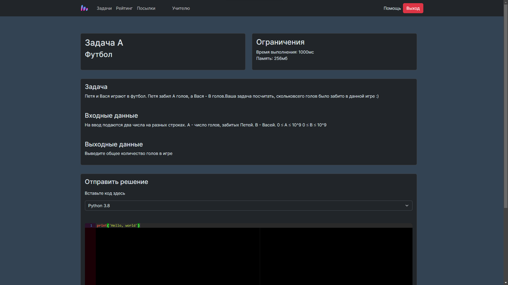

# CodeBattles 🏆

[](./LICENSE)
[](https://github.com/CodeBattles-nn/CodeBattles/commits)
[](https://github.com/CodeBattles-nn/CodeBattles)
[](https://github.com/CodeBattles-nn/CodeBattles)

A comprehensive programming competition system designed for educational institutions, coding competitions, and skill assessment.



## 🔗 Quick Links


- 📚 [Documentation (RU v3)](https://docs.codebattles.ru/ru_v3)
- 📚 [Documentation (EN v3)](https://docs.codebattles.ru/en_v3)
- 🌐 [Official Website](https://codebattles.ru)
- ☕ [Support the Project](https://www.donationalerts.com/r/doctorixx)

## ✨ Features

- **Competition Management**: Create and manage programming contests with ease
- **Real-time Judging**: Automated code evaluation and scoring
- **Multi-language Support**: Support for various programming languages
- **User Management**: Role-based access control for participants and administrators
- **Live Leaderboards**: Real-time ranking and progress tracking
- **Task Generation**: Built-in UI for creating competition tasks (v3.x.x+)

## 🚀 Quick Start

### Prerequisites

- Docker
- Docker Compose

### Installation

1. **Clone the repository**
   ```bash
   git clone https://github.com/CodeBattles-nn/CodeBattles.git
   cd CodeBattles
   ```

2. **Start the application**
   ```bash
   docker compose up
   ```

   > 💡 **Tip**: Run in background mode with the `-d` flag:
   > ```bash
   > docker compose up -d
   > ```

3. **Access the application**
   
   Open your browser and navigate to [http://localhost:2500](http://localhost:2500)

## 🔄 Updating

To update to the latest version:

```bash
# Pull the latest changes
git pull

# Restart the application
docker compose up
```

## ⚙️ Configuration

### Default Ports

| Service  | Port  | Description |
|----------|-------|-------------|
| Gateway  | 2500  | Main application interface |
| Database | 25565 | Database connection |

### Task Management

Starting from version 3.x.x, competition tasks can be created and managed through the web interface, making it easier for administrators to set up contests without technical knowledge.

## 🖥️ Platform Compatibility

| Architecture | Status | Notes |
|--------------|:------:|-------|
| x64          | ✅     | Requires manual build |
| aarch64      | ✅     | Requires manual build |
| x32          | ❓     | Not tested |

## 🤝 Contributors

We're grateful to these amazing contributors who have helped make CodeBattles better:

### Core Contributors
- **[Doctorixx](https://github.com/doctorixx)** - Project maintainer and lead developer
- **user3050** - Security audit and vulnerability assessment
- **[Zeevss](https://github.com/Zeevss)** - Testing, quality assurance, and feature suggestions

### Special Thanks
- **[school30nn](https://school30nn.ru)** - For adopting the system and providing valuable server resources

## 🛠️ Development

### Security Analysis
This project uses [PVS-Studio](https://pvs-studio.com/pvs-studio/?utm_source=website&utm_medium=github&utm_campaign=open_source) for static code analysis, ensuring high code quality and security standards.

## 💖 Support the Project

If you find CodeBattles useful and want to support its development:

- ☕ [DonationAlerts](https://www.donationalerts.com/r/doctorixx)
- 💳 [YooMoney](https://yoomoney.ru/fundraise/13V1T7RVQBE.240713)

## 📄 License

This project is licensed under the terms specified in the [LICENSE](./LICENSE) file.

## 🐛 Issues & Support

Found a bug or need help? Please check our [documentation](https://docs.codebattles.ru/ru_v3) first, then feel free to:

- 🐛 [Report issues](https://github.com/CodeBattles-nn/CodeBattles/issues)
- 💬 [Join discussions](https://github.com/CodeBattles-nn/CodeBattles/discussions)
- 📧 Contact the maintainers

---

**CodeBattles** © 2024-2025 | Built with ❤️ for the programming community
